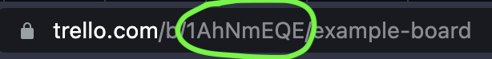
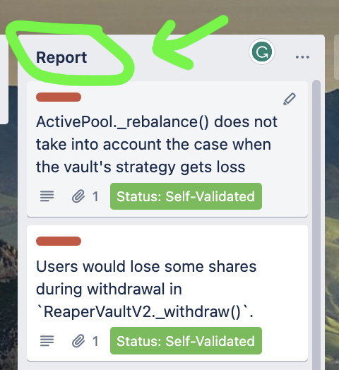
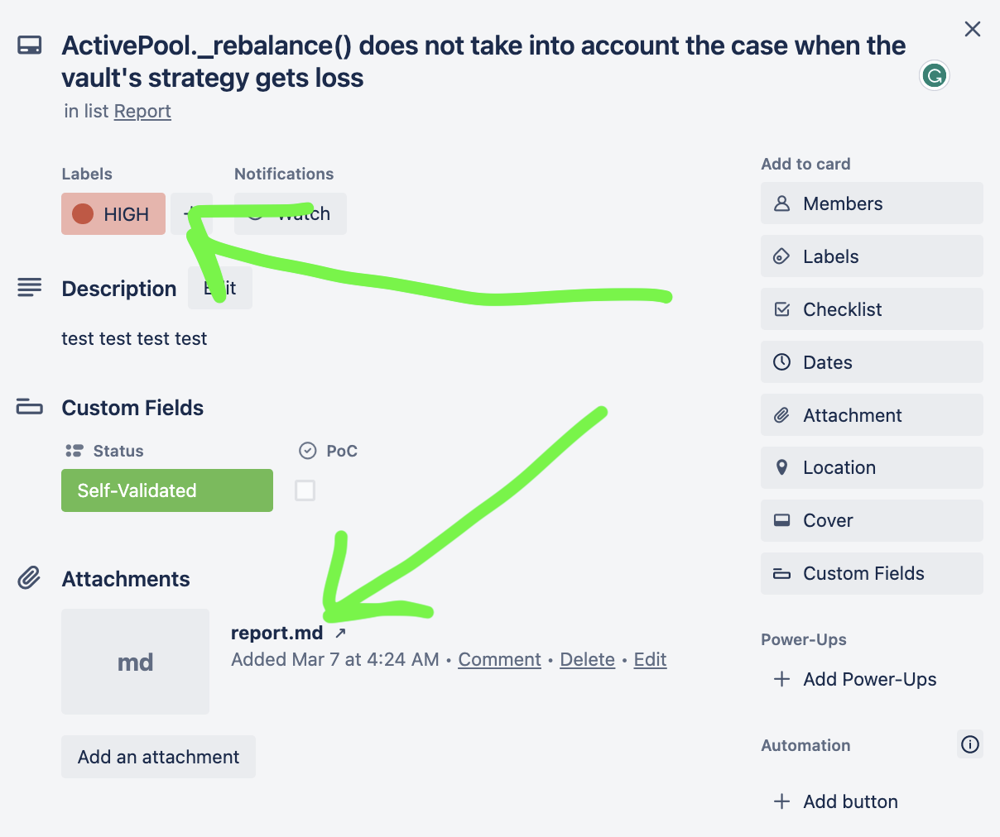

# Trello To Audit Report

A way to easily generate a markdown file from a trello board.

# Getting Started

## Requirements


- [git](https://git-scm.com/book/en/v2/Getting-Started-Installing-Git)
  - You'll know you did it right if you can run `git --version` and you see a response like `git version x.x.x`
- [Python](https://www.python.org/downloads/)
  - You'll know you've installed python right if you can run:
    - `python --version` or `python3 --version` and get an output like: `Python x.x.x`
- [pipx](https://pypa.github.io/pipx/installation/)
  - `pipx` is different from [pip](https://pypi.org/project/pip/)
  - You may have to close and re-open your terminal
  - You'll know you've installed it right if you can run:
    - `pipx --version` and see something like `x.x.x.x`

### Optional

If you want to convert trello -> PDF, you'll also need to install [pandoc](https://pandoc.org/). Please see [this repo](https://github.com/ChainAccelOrg/audit-report-templating) for learning how to install and work with pandoc. 

You will additionally need the `eisvogel.latex` template. You can find more information in the repo linked above. 

## Installation

There are a few options with how to install.

### pipx 

We recommend using `pipx` as it installs your package into a virtual environment. 

```
pipx install trello_to_audit_report
```

Then, verify it's installation: 
```
trello_to_audit_report -v
```

To upgrade to the lastest version, run:

```
pipx upgrade trello_to_audit_report
```

You should get an output like `x.x.x`

### pip

Otherwise, you can use `pip`.

```
pip install trello_to_audit_report
```

### From Source

You can install from source.

```
git clone https://github.com/ChainAccelOrg/trello_to_audit_report
cd trello_to_audit_report
pip install . -e
```

## Quickstart - CSV

1. Place all your findings in a list on a trello board, and have one list called `Report`
2. [Export your board](https://support.atlassian.com/trello/docs/exporting-data-from-trello/) to a `.csv` file
3. Run:

```
trello_to_audit_report <PATH_TO_YOUR_CSV>
```

And you'll get a file named `output.md` with all your code formatted!

## Quickstart - Directly from Trello

To create a report directly from Trello, do the following:

1. Create an [API Key & Token](https://developer.atlassian.com/cloud/trello/guides/rest-api/api-introduction/)
   1. Navigate to [trello power ups](https://trello.com/power-ups/admin)
   2. Select "New"
   3. Fill in some information (you can skip the Iframe connector stuff)
   4. Then, select the hyperlinked "token" on that page, and "turn on" your token by [authenticating it.](https://developer.atlassian.com/cloud/trello/guides/rest-api/api-introduction/#authentication-and-authorization)
   5. Save the API Key and Token 
2. Create `TRELLO_API_KEY` and `TRELLO_API_TOKEN` environment variables.
   1. Or, you can pass them in as flags if you're unfamiliar with environment variables
3. Select your board ID
   1. Each trello board has an ID, you can find it by looking at the URL of the board you're working with
      1. 
4. Make sure you have the following:
   1. The list of findings are in a list labeled "report 
      1. 
   2. Each report has the report written and named `report.md` (if you don't have one, it'll just grab the first attachment)
   3. Each report has a label of "HIGH", "MEDIUM", "LOW", "QA", or "GAS" 
      1. 
5. Run the following

```
trello_to_audit_report <BOARD_ID> --api-key <API_KEY> --token <API_TOKEN>
```

And you should get a markdown output to `output.md`!


## Quickstart - Advanced

The package can also:
- Generate a PDF
- Add any default text before the file

We have some examples in this repo if you [installed from source](#from-source).

```
trello_to_audit_report 1AhNmEQE --pdf-output examples/example_pdf.pdf --text-before-file examples/example_text_before.md -o ./examples/example_markdown.md
```


# More Resources

You can then, dump it into `pandoc` to generate a PDF. We have [a repo](https://github.com/ChainAccelOrg/audit-report-templating) that shows you how to do that as well. 
